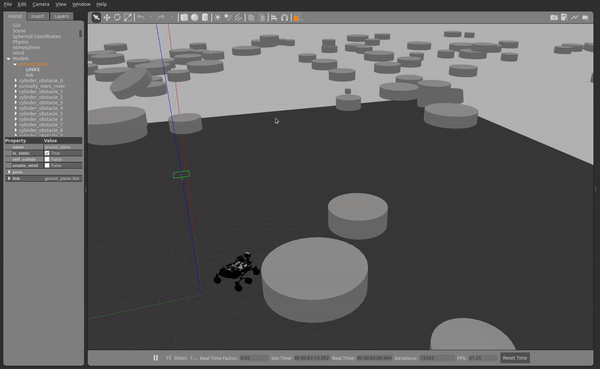

# The Ariadne's Thread Team Repo (Class )

<!-- Add gif -->
<p align="center">
  

## Description

We built a simulation enviroment using ROS and Gazebo to test the performances of various planning algorithms. The test
scenario consists in a collaborative planning between ground and aerial robots for planetary exploration. The ground robot
uses the aerial map generated by the flying robot to efficiently plan its path. The flying robot is responsible for
exploring the environment and generating a map of the obstacles the rover could encounter on its path.

## Requirements

To run the code you need to have ROS Noetic installed on your machine. You can find the installation
instructions [here](https://wiki.ros.org/noetic/Installation/).
If you cannot install ROS, you can use our Docker image (see below 
for instructions on how to run the code using Docker).

## Running the code

To try out our code use the following command:

```bash
mkdir -p ariadne_ws/src
cd ariadne_ws/src
git clone git@github.com:viciopoli01/The-Ariadne-s-Thread.git
```

Then build the workspace with:

```bash
cd ..
catkin build curiosity_mars_rover_description ariadne
```

To run the code use the following command:

```bash
source install/setup.bash
roslaunch ariadne ariadne_rover.launch
```

## Docker

Make sure you have a Docker installed on your machine. You can find the installation instructions [here](https://docs.docker.com/get-docker/).
Run the following commands to build and run the Docker image:

```bash
docker build -t ariadne:amd64 .
xhost +local:root 
docker run --net=host --rm --privileged -e DISPLAY=$DISPLAY -v /tmp/.X11-unix:/tmp/.X11-unix --name ARIADNE -it ariadne:amd64
```

In the log a link to open the juptyer notebook will be displayed. Open the link in your browser and open the `planner_notebook.ipynb` file.
Write the code in the notebook and run the cells to see the results.

## Report

The report of our project can be found [here]().
To reproduce the results of the report, switch to the `results` branch and make sure to build and source the ROS enviroment, after that run the following commands:

```bash
rosrun ariadne compare_planners.py
```

## Authors

- [@viciopoli01](https://github.com/viciopoli01)
- [@na-luka](https://github.com/na-luka)
- [@justmohsen](https://github.com/JustMohsen)
- [jason]()

## Acknowledgements

- The rover simulation enviroment is the one provided by NASA JPL at [ROSjects](https://rds.theconstructsim.com/tc_projects/use_project_share_link/ab7e9a02-8907-4208-996a-ba1f45c20db2). We modify the gazebo files to run with ROS Noetic.
- Our A* algorithm is based on the code stack of [AtsushiSakai/PythonRobotics](https://github.com/AtsushiSakai/PythonRobotics).
